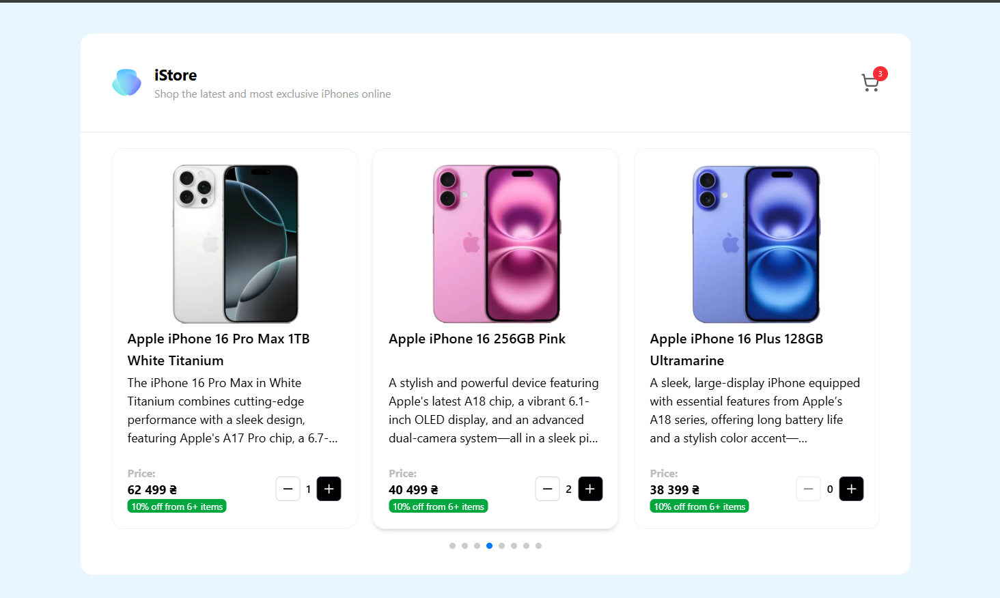

# 📱 iStore — React + TypeScript + Vite

A modern, responsive e-commerce frontend application featuring a product carousel, shopping cart with persistent state, bulk discount logic, and a polished user experience.



## 🔗 Live Demo
https://test.com

---

## ✨ Features

- 🛒 **Shopping Cart** with persistent state (survives page reloads)
- 💰 **Automatic Bulk Discounts** — 10% off for orders of 6+ items
- 🎠 **Responsive Product Carousel** with auto-play on desktop
- 🔔 **Toast Notifications** for cart actions
- 📱 **Fully Responsive** — works on mobile, tablet, and desktop
- ⚡ **Lightning Fast** — built with Vite
- 🎨 **Modern UI** — styled with Tailwind CSS 4

---

## 🛠️ Tech Stack

### **Core**

- [React 19](https://react.dev/) — UI library
- [TypeScript 5](https://www.typescriptlang.org/) — Type safety
- [Vite 7](https://vite.dev/) — Build tool & dev server

### **State & Routing**

- [Zustand 5](https://github.com/pmndrs/zustand) — Lightweight state management
- [React Router 7](https://reactrouter.com/) — Client-side routing

### **UI & Styling**

- [Tailwind CSS 4](https://tailwindcss.com/) — Utility-first CSS
- [Swiper 12](https://swiperjs.com/) — Touch-enabled carousel
- [Lucide React](https://lucide.dev/) — Beautiful icons
- [React Hot Toast](https://react-hot-toast.com/) — Toast notifications

### **Developer Tools**

- ESLint 9 + TypeScript ESLint — Code linting
- SWC — Fast TypeScript compilation

---

## 🚀 Getting Started

### Prerequisites

- Node.js 18+
- npm or yarn

### Installation

1. **Clone the repository**

```bash
git clone https://github.com/vladp456/product-carousel.git
cd product-carousel
```

2. **Install dependencies**

```bash
npm install
```

3. **Start development server**

```bash
npm run dev
```

4. **Open your browser**

```
http://localhost:5173
```

---

## 📂 Project Structure

```
src/
├── components/              # Reusable UI components
│   ├── ErrorBoundary.tsx
│   ├── Layout.tsx
│   ├── Navbar.tsx
│   ├── ProductCard.tsx
│   └── ProductCarousel.tsx
├── pages/                   # Page components
│   └── Cart.tsx
├── store/                   # Zustand stores
│   └── cartStore.ts
├── hooks/                   # Custom React hooks
│   ├── useMediaQuery.ts
│   └── useDismissToastsOnRouteChange.ts
├── utils/                   # Utility functions
│   ├── priceCalculations.ts
│   └── cartToast.tsx
├── constants/               # App constants
│   └── cart.ts
├── types/                   # TypeScript types & declarations
│   ├── Cart.ts
│   ├── Product.ts
│   └── swiper.d.ts          # Swiper type declarations
├── data/                    # Mock data
│   └── products.ts
├── App.tsx                  # Main app component
└── main.tsx                 # Entry point
```

---

## 🎯 Key Features Explained

### **Bulk Discount System**

Products automatically receive a 10% discount when 6 or more items are added to the cart.

```typescript
const DISCOUNT_THRESHOLD = 6
const DISCOUNT_PERCENTAGE = 0.1

const hasDiscount = quantity >= DISCOUNT_THRESHOLD
const discountedPrice = price * (1 - DISCOUNT_PERCENTAGE)
```

### **Persistent Shopping Cart**

Cart state is saved to localStorage using Zustand's persist middleware, so your cart survives page refreshes.

### **Responsive Carousel**

- Desktop: Auto-plays with 3 products visible
- Tablet: 2 products visible
- Mobile: 1 product visible with swipe support

---
